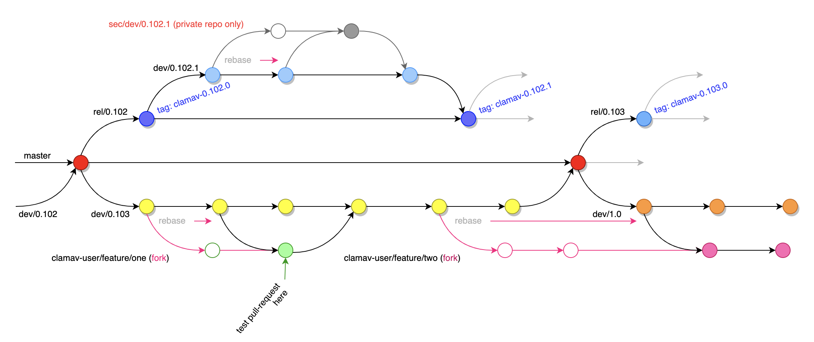
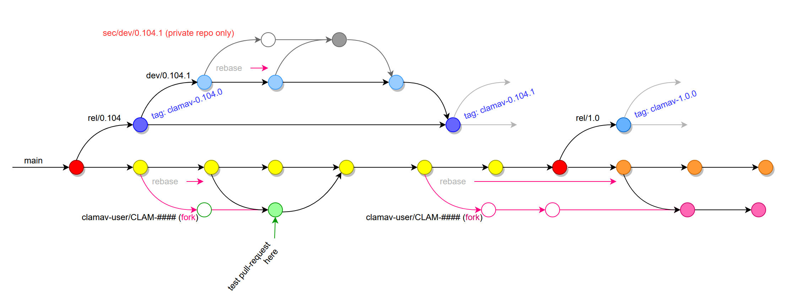

# ClamAV Git Work Flow

ClamAV's Git work flow isn't very complicated, but it is more structured than most. It looks like this. Note that in the diagrams below, merged branches are regular merges and will add all of the commits from the source branch to the destination branch. The diagram doesn't show all the merged commits, for simplicity:

`dev/0.102`, `dev/0.103`, and `dev/0.104`:

The development branchs. During development, each are set to be the "default" branch. testing is done in pull-requests (PR's), so this branch should be stable, though we make no guarantees. We have found that having a different default branch for each feature development has not been as helpful as originally thought. We will be stopping this pratice after `dev/0.104` is complete. See "Coming soon", below.

`master`:

The `master` branch was intended to always be stable and to be updated as needed from the feature development branches after extensive testing demonstrated that it was truly stable. However, in practice this wasn't useful and so we mostly stopped using `master` except to update it between feature releases. This is another reason for our upcoming work flow change.

`rel/0.102`, `rel/0.103`:

Feature release branches. These always contain the latest stable patch versions for each feature release. When development on a feature release (E.g. `dev/0.102`) or a patch release (E.g. `dev/0.102.1`) is complete, they are merged here and tagged.

`dev/0.102.1`:

A development branch used to test hotfixes prior to a patch release

`sec/dev/0.102.1`:

A private development branch used to test security-related hotfixes prior to a patch release. This branch will be rebased like any feature branch as needed up until the release at which point it is merged into the `dev/0.102.1` branch and the `dev/0.102.1` branch is merged into the `rel/0.102` branch and tagged as "`clamav-0.102.1`".

`feature/blah`:

A long-running branch for adding a major feature. It may be rebased several times with the default branch before it is ready to merge.

`CLAM-####-description`, `issue-####-description`, `bb####-description`:

A branch for working a JIRA task, GitHub issue, or Bugzilla Bug. These are typically only found in a personal fork and appear as pull requests from the fork to the upstream `clamav` repository.

Pull requests are ALWAYS rebased before being merged, to maintain a linear history.

> **Coming soon**: As mentioned above, the default branch will be changing. After 0.104.0 has been published, we will stop using `dev/*` branches for feature development work, after which all new development will be done in a `main` branch (replacing `master`).
>
> The new Git work flow will then look like this:
>
> 
>
> `main`:
>
> the development branch. testing is done in pull-requests (PR's), so this branch should be stable, though we make no guarantees.
>
> `rel/0.104`, `rel/1.0`:
>
> Feature release branches. These always contain the latest stable patch versions for each feature release. When development on a feature release (E.g. `dev/0.104`) or a patch release (E.g. `dev/0.104.1`) is complete, they are merged here and tagged.
>
> `dev/0.104.1`:
>
> A development branch used to test hotfixes prior to a patch release
>
> `sec/dev/0.104.1`:
>
> A private development branch used to test security-related hotfixes prior to a patch release. This branch will be rebased like any feature branch as needed up until the release at which point it is merged into the `dev/0.104.1` branch and the `dev/0.104.1` branch is merged into the `rel/0.104` branch and tagged as "`clamav-0.104.1`".
>
>
> `feature/blah`:
>
> A long-running branch for adding a major feature. It may be rebased several times with the default branch before > it is ready to merge.
>
> `CLAM-####-description`, `issue-####-description`, `bb####-description`:
>
> A branch for working a JIRA task, GitHub issue, or Bugzilla Bug. These are typically only found in a personal > fork and appear as pull requests from the fork to the upstream `clamav` repository.
