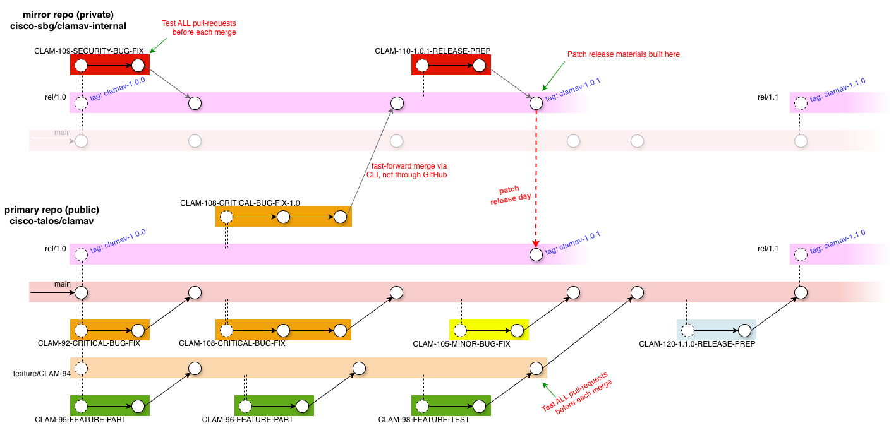

# ClamAV Git Work Flow

ClamAV's Git work flow isn't very complicated, but it is more structured than most. It looks like this. Note that in the diagrams below, merged branches are regular merges and will add all of the commits from the source branch to the destination branch. The diagram doesn't show all the merged commits, for simplicity:

#### `main`:

The development branch. testing is done in pull-requests (PR's), so this branch should be stable, though we make no guarantees.

#### `rel/1.0`, `rel/1.1`, etc.:

Feature release branches. These always contain the latest stable patch versions for each feature release.

When development towards the next feature release is complete, a new `rel/X.Y` branch is created from `main` and a release tag is created.

The ClamAV team develops security fixes in an internal mirror of the `clamav` repository. Work for the next patch release takes place on an internal `rel/X.Y` branch. When the release is ready, the team publishes those commits to the corresponding public branch and creates a release tag. For example, ClamAV 1.0.1 would be published from the internal `rel/1.0` branch to the public `rel/1.0` branch and tagged `clamav-1.0.1`.

#### `feature/description`:

A long-running branch for adding a major feature. It may be rebased several times with the default branch before it is ready to merge.

#### `CLAM-####-description`, `issue-####-description`:

A branch for working a JIRA task or GitHub issue. These are typically only found in a personal fork and appear as pull requests from the fork to the upstream `clamav` repository.
