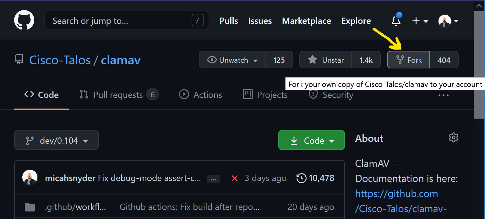
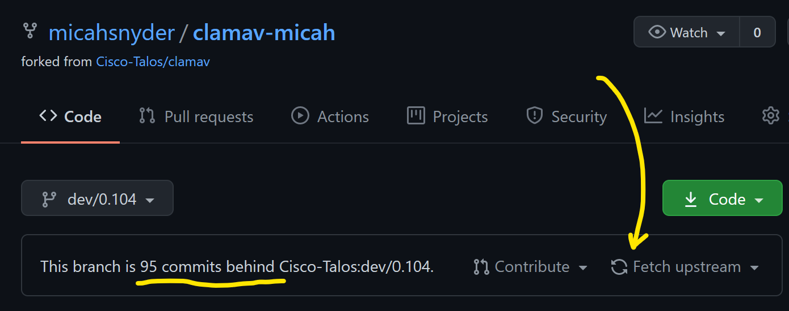
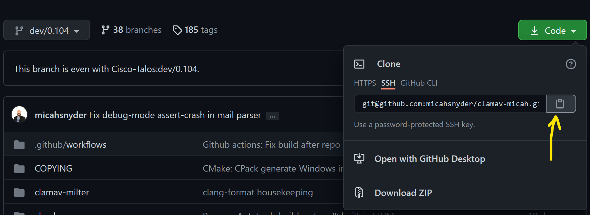

# Working with a Your Own Fork of the ClamAV repository

A "fork" on GitHub is a personal playground. Though the word "fork" in the concept of open source traditionally referred to creating (and maintaining) a new variant of a project, forks on GitHub/GitLab/BitBucket/etc these days typically refer to a personal copy of the project where a user can test modifications to fix a bug or add a feature before contributing it back to the project in the form of a "pull request".

### Create and Maintain a Personal Fork

You may only have one for any project, but it is very easy to create:



You can rename it as needed so you won't confused a clone of your fork with that of the upstream `clamav` repository. Go to the "Settings" page and change the name to add your name in a suffix:


You're free to add or delete branches in your fork as you see fit, but I would advise against adding your own commits to the existing branches. The existing branches, particularly the default branch`*` are a reference from which you can create your own branches for your work. Adding your own commits to the existing branches will break your ability to synchronize with the upstream `Cisco-Talos/clamav` repository, and without more advanced Git experience you won't be able to correct it.

> _Tip_: If you've managed to screw up the commit history in your fork to the point where you don't know how to fix it, you can always delete your fork and create a new one.

Your fork is a snapshot of the upstream `clamav` repository at the moment at which you created it. Left unmaintained, your fork's default branch will get left behind. Unlike BitBucket, GitHub will not sync branches for you automatically. If your branch is behind, it is simple to sync the branch on your fork using GitHub's GUI by pressing the "Fetch Upstream" button:



You can sync other branches too. Simply switch branches to the desired branch and press "Fetch Upstream" again.

> _Disclaimer_: The ClamAV project has a history of changing default branches for development on each feature version. We've found that this causes more trouble than it is worth, and we intend to stop doing that after 0.104. Right now, the default branch is `dev/0.104`. After 0.104 is complete, it will be changed to `main` and we'll stop changing it. For more details, see the work flow changes in the section below.
>
> _Tip_: After we change the default branch for `Cisco-Talos/clamav` to `main`, you'll need to change your default branch too (it won't switch in your fork just because we changed the default in the upstream repo).

### Working with a Clone of your Fork on the Command Line

If you don't already have an SSH key for your GitHub account, I recommend creating one. Navigate to your Account Settings and under SSH and GPG keys, click the "New SSH key" button. If you're unfamiliar with how to generate an SSH key, there's a nearby link "generating SSH keys" with additional instructions.

Next, clone your ClamAV *fork*. Use the "Code" button on the default page for your fork to copy the "SSH" URL. If you don't want to use an SSH key for GitHub authentication, use the HTTPS URL instead:



Now open up a terminal and type:

```bash
git clone <paste that Git URL>
cd clamav-YourNameHere
```

Create a branch off of the default branch where you will work. If working on a GitHub Issue, or JIRA task`*`, the following branch name prefixes will help you and others identify the branch:
- For GitHub issues: `issue-####-short-description`
- For JIRA task: `CLAM-####-short-description`

> _Note_: `*`The ClamAV JIRA task tracker is not accessible outside of the Cisco network.

Create your working branch:
```
git checkout -b issue-####-short-description
```

You're now ready to make edits to the source. Be sure your changes match our code format style. The easiest way is to install `clang-format` and enable "Format On Save" in your text editor.

When you have made your changes, run:
```bash
git add -u
git commit
```

Leave a meaningful git commit message that has a high-level descriptive title, and a more technical message body describing why the change was needed what your commit does to resolve it.

Run this to upload your commit to your fork on GitHub:
```bash
git push -u origin <the_name_of_your_branch>
```

The `-u origin` argument will enable tracking between your local branch and your remote branch. In the future you will only need to do `git push` and it will know where to push it.

### Rebase your development branch with the upstream `main` branch and resolving merge conflicts

If you don't already have it:
```
git remote add upstream git@github.com:Cisco-Talos/clamav.git
```

Then run:
```
git fetch upstream
git rebase upstream/main
```

If you have any merge conflicts, you'll now have the opportunity to fix them. After every conflict is resolved and you've saved the files in question, run `git add <the resolved files>` and then run `git rebase --continue`.
