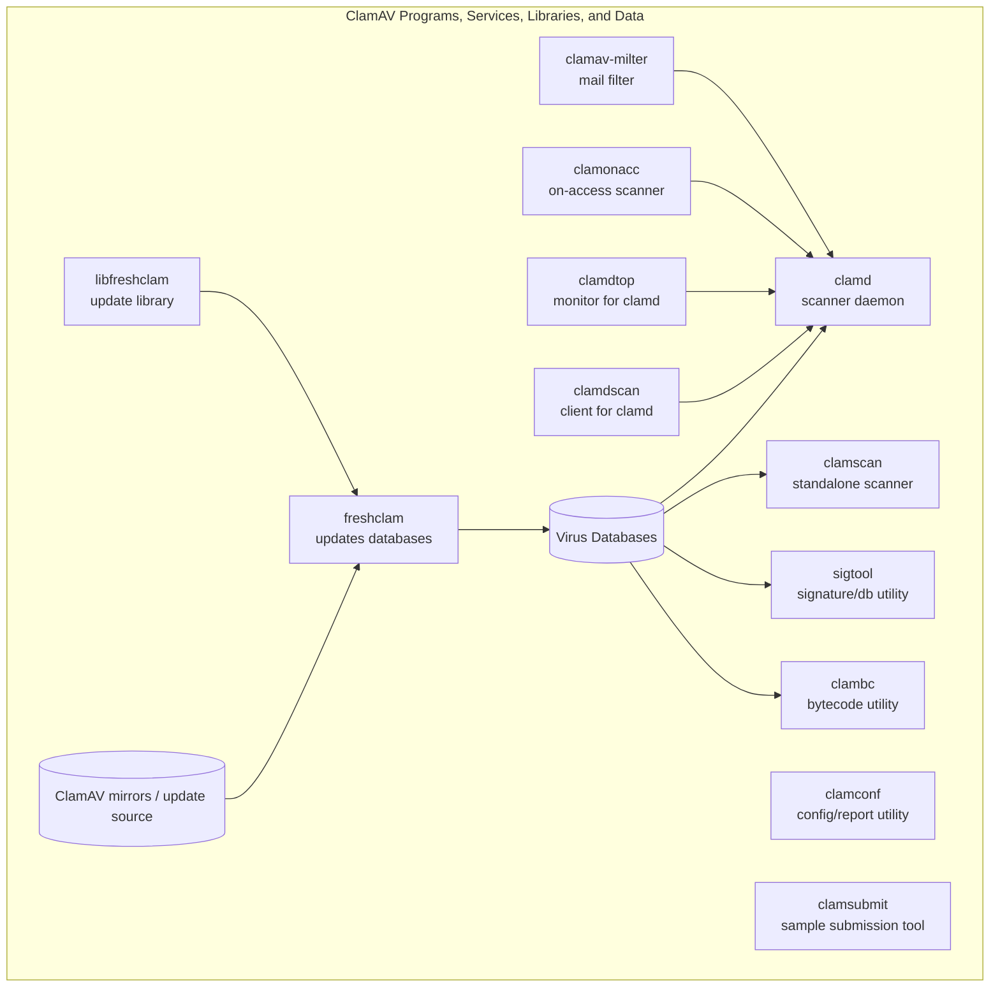
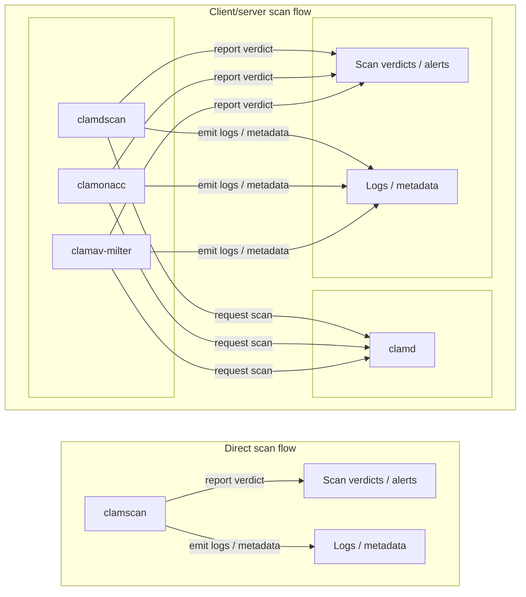

# Usage

Table Of Contents

- [Usage](#usage)
  - [Purpose](#purpose)
  - [High-Level Software Diagram](#high-level-software-diagram)
  - [Rough Scan Flowchart](#rough-scan-flowchart)
  - [Daemon](#daemon)
  - [Scanner](#scanner)
  - [Signature Testing and Management](#signature-testing-and-management)
  - [Configuration](#configuration)

## Purpose

This user guide presents an overview of the various ways that *libclamav* can be used through the tools provided by ClamAV. To learn more about how to better use each facet of ClamAV that interests you, please follow the links provided.

## High-Level Software Diagram

## Rough Scan Flowchart

## Daemon

The ClamAV Daemon, or [`clamd`](Usage/Scanning.md#clamd), is a multi-threaded daemon that uses *libclamav* to [scan files for viruses](Usage/Scanning.md). ClamAV provides a number of tools which interface with this daemon. They are, as follows:

  - [`clamdscan`](Usage/Scanning.md#clamdscan) - a simple scanning client
  - [`clamonacc`](Usage/Scanning.md#On-access-scanning) - provides on-access scanning (aka real-time protection via a `clamd` instance
  - [`clamav-milter`](Usage/Scanning.md#On-access-scanning) - a mail filtering plugin for the Sendmail email processing server software to scan emails
  - [`clamdtop`](Usage/Scanning.md#clamdtop) - a resource monitoring interface for `clamd`

## Scanner

ClamAV also provides a command-line tool for [simple scanning](Usage/Scanning.md) tasks with *libclamav* called [`clamscan`](Usage/Scanning.md#clamscan). Unlike the daemon, `clamscan` is not a persistent process and is best suited for use cases where one-time scanning with minimal setup is needed.

## Signature Testing and Management

A number of tools allow for [testing and management of signatures](Usage/SignatureManagement.md). Of note are the following:

  - [`clambc`](Usage/SignatureManagement.md#clambc) - specifically for testing bytecode
  - [`sigtool`](Usage/SignatureManagement.md#sigtool) - for general signature testing and analysis
  - [`freshclam`](Usage/SignatureManagement.md#freshclam) - used to update signature database sets to the latest version

## Configuration

The more complex tools ClamAV provides each require some degree of [configuration](Usage/Configuration.md). ClamAV supplies two example configuration files:

  - [`clamd.conf`](Usage/Configuration.md#clamdconf) - for configuring the behavior of the ClamAV Daemon `clamd` and associated tools
  - [`freschclam.conf`](Usage/Configuration.md#freshclamconf) - for configuring the behavior of the signature database update tool, `freshclam`

Additionally, a tool called [`clamconf`](Usage/Configuration.md#clamconf) allows users to check the configurations used by each other tool, pulling information from the configuration files listed above, alongside other relevant information.
